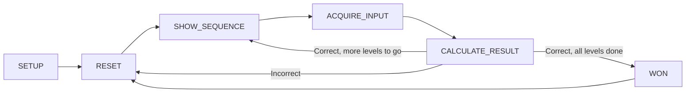

# ArduinoMemory

| :exclamation: This is my first project with Arduino and I am an absolute beginner! No warranties whatsoever! |
|--------------------------------------------------------------------------------------------------------------|

Introduction
------------

I recently bought myself an Arduino Mega2560 Starter Kit while on holiday. Other than the knowledge that it existed,
I had no idea how it worked or what one can do with it. Also, I had never done anything with electronics before in my life
so needless to say, I was (and still am) an extreme beginner.

After doing some elementary stuff with it, like flashing LEDs and that sort of thing, I wanted to make something bigger.
I thought I was original by implementing a game I dubbed 'ArduinoMemory', which consists of memorizing an increasing sequence of short-and long LED flashes and then repeating that by use of a button.

I built and implemented it, only to discover afterwards that this game is actually called 'SimonSays' and had been done
a million times before ;-)

Nevertheless, I still wanted to put this on GitHub as I thought it was nice to implement. Perhaps you find it useful
also. Feedback is also welcomed :-)

The Game
--------

The object of the game is for the player to memorize an increasing sequence of light flashes - which can be a short flash or a long flash - and to reproduce said sequence using a physical button. The game is for a single player and consists of `maxRounds` rounds. 

Each round, a red LED will display a random sequence of short-and long flashes which the player needs to memorize. At the start of the game, the sequence is of length one.

After the LED has flashed, the player must recreate the short-and long sequence by pressing the button, whereby
a short press means 'short flash' and a long press means 'long flash'.

If the sequence is repeated correctly, the sequence is lengthened by one and the game continues as described above. If the player has succesfully memorized and reproduced the final sequence of length `maxRounds`, the player has won.

If at any time the sequence is not repeated correctly, the player has lost and the game will restart with a new sequence of length one.

For an example of the game in progress, scroll down to the Example section for a movie!

Implementation
--------------

This section gives a few pointers on the hardware and software implementation.

### Hardware

As you can see in the picture above, or using the schematics (the .fzz file in the repository can be opened with software from https://fritzing.org),
the implementation has several components:

|Component|Function|Pin|Remark|
|---------|--------|---|------|
|Red LED  |Flashes the sequence that the player has to memorize| 30 |The LED also gives visual feedback on the button presses which is described in more detail under 'button press handling' below|
|Yellow LED|Indicates whether the player can start reproducing the sequence|34|
|Passive buzzer|Supplies sound effects|32|Actual buzzer component is much smaller in real life than depicted in the schematics|
|Button   |Button for the player to reproduce the memorized sequence|2|Pins in the 30 range are OUTPUT pins only; button requires an INPUT pin, hence the choice for pin 2|
|Resistors|Prevents burning LEDs|||

### Software

The software is really straightforward as can be seen from the commented code. However, two aspects are highlighted here for clearity.

#### State machine

The code implements a simple state machine to handle all logic. While the code is self-explanatory, it might help to use this visual representation of the state machine:

|STATE|Function|
|-----|--------|
|SETUP|This is the boot up process which starts the moment the Arduino gets power and is executed only once|
|RESET|The game is set to its starting position|
|SHOW_SEQUENCE|The game displays the sequence to the player using the red LED|
|ACQUIRE_INPUT|The game accepts the players input from the button and the yellow LED lights up to indicate this to the user. The yellow LED turns off when it has received `n` button presses where `n` is the length of the sequence|
|CALCULATE_RESULT|Checks if the reproduced sequence matches the sequence that was shown by the red LED. Depending on the result, the game either starts over, continues to the next level or goes to the won state|
|WON|A song is played to indicate the victory of man over machine|

#### Button press handling

The handling of the button press may look a little complex, but it really isn't too difficult. The idea was to have the red LED give feedback to the player that their button press was registered properly. For a short press, this was easy: just activate the LED on down press and deactivate on depress.

The situation for a long press is a bit more difficult. In the first version, the red LED was on until the player released the button... it was up to the player to 'guess' if the button was pressed long enough to register for a 'long press'. Obviously this is error prone and frustrating.

Therefore, it was decided to automatically turn off the red LED if the button was pressed long enough to be registered as a long press.

The way this is done is simple:

1. When the button is pressed:
    * it registers the time in milliseconds when the button was pressed
    * the boolean `isPressed` is set to signal the button state handler that the next time it registers the button is not pressed, it knows that it was released
    * the red LED is turned on
2. If the button is in a pressed state for more than `LONG_PRESS_LENGTH` milliseconds
    * the boolean `isLong` is set
    * the red LED is turned off
3. When the button is depressed:
    * `isPressed` is set to false
    * it is checked if `isLong` is true in which case a long press is registered
    * if is checked if `isLong` is false in which case a short press is registered

This implements a far better user experience for the player as it is now unambigious to the player if the game registers a long or a short press!

Example
-------

A short movie of the end result can be found by clicking the preview below:

Conclusion
----------

The process of buying the Arduino set, learning how to set it up and program it was extremely satisfying! This repository obviously gives no warranties and it's probably not the best code out there but it might inspire others to play with Arduino!
